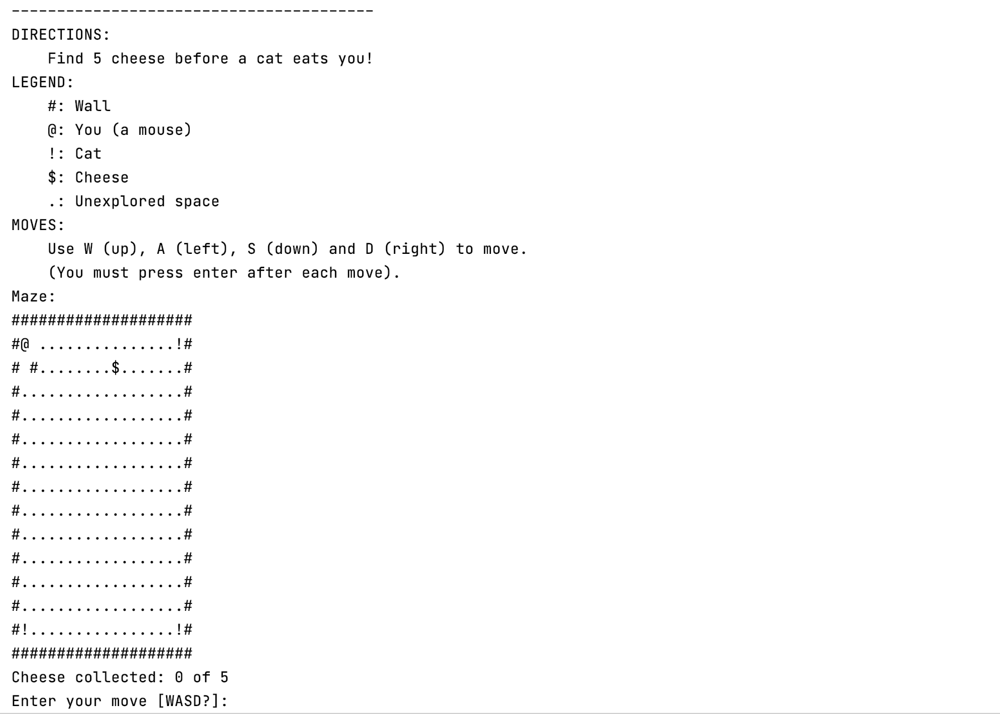
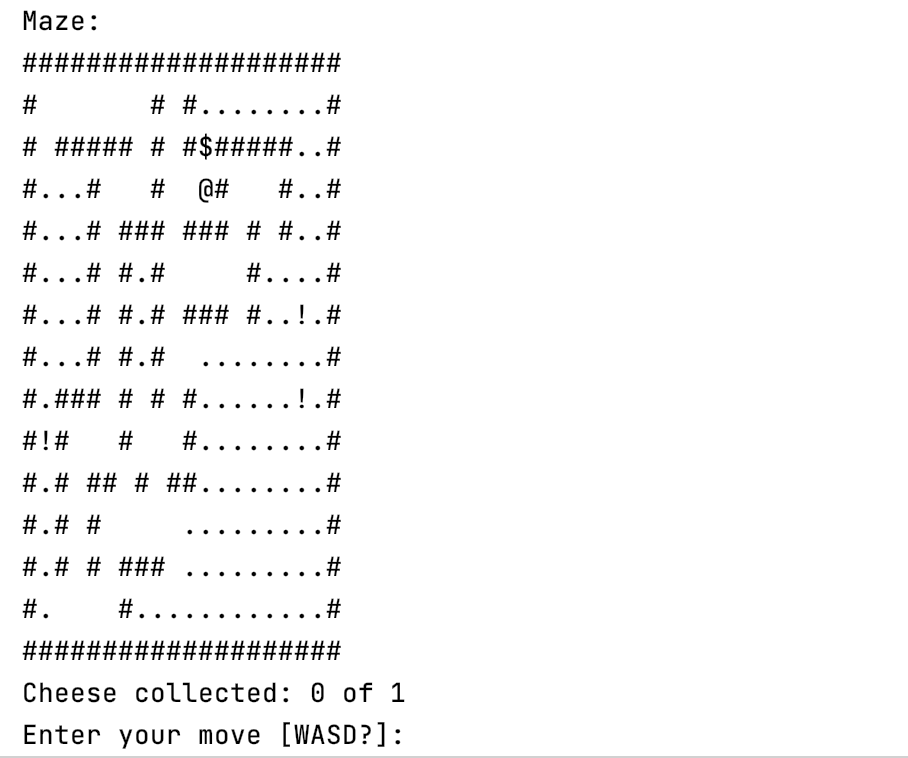
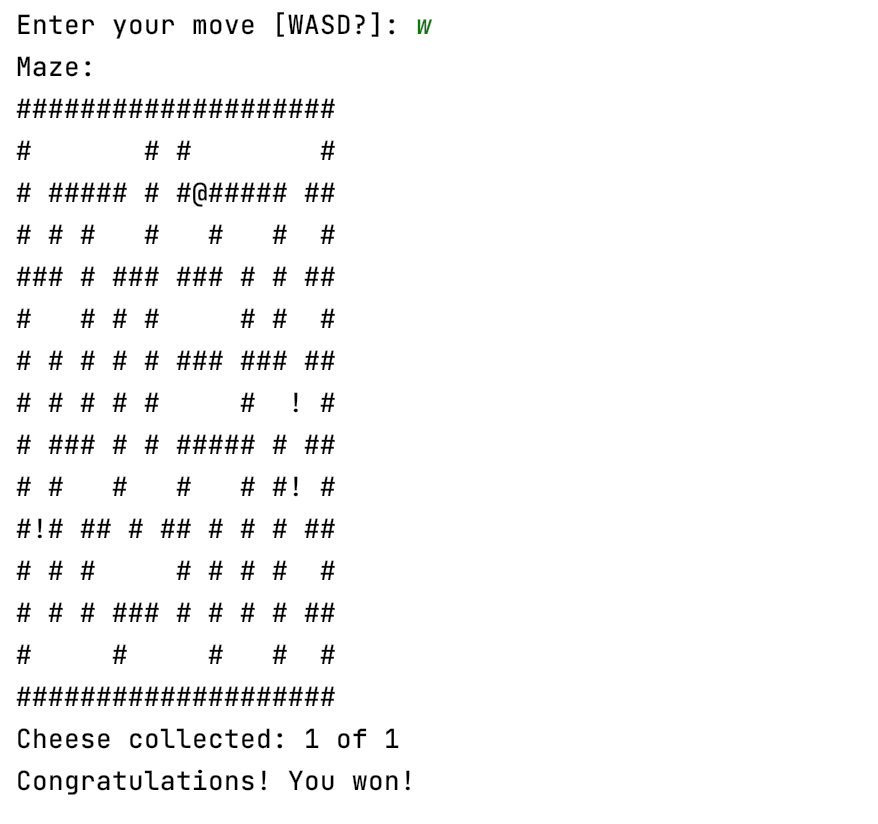

# Maze Game

A command line game where the player becomes a mouse who wants to escape the maze.

## Game Description

The player's goal is to control a mouse while collecting a certain number of cheeses to win the game. At the same time, several blind cats are wandering around the maze who will eat the mouse. If the mouse and the cat ever occupy the same cell, the player loses the game. 

 

At the start of the game, the player cannot see the overview of the maze. But as the player moves through the maze, all squares adjacent to the player are revealed.

 

The game takes place in a maze with:
- walls (#)
- mouse (@)
- cats (!)
- cheese ($)
- unexplored spaces (.)

## Screenshots

###### Instruction

  	

###### Game Play

  	

###### You Win

  	

## Members

- Jiwon Jun
- Jieung Park
